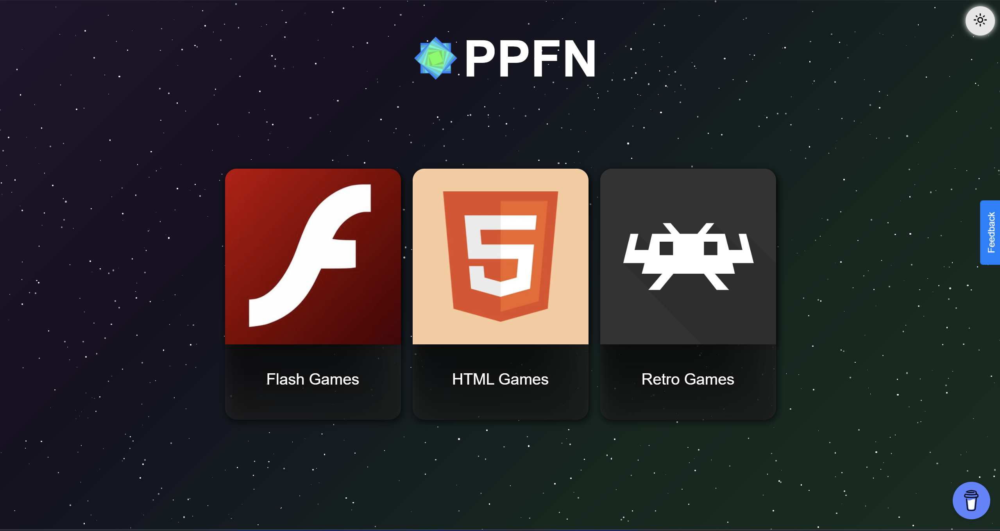

# PPFN Static


**PPFN Static** is a fast, lightweight, and easy-to-host HTML5 gaming site. This static version is designed for simple deployment on any static file host, such as GitHub Pages, with no backend or server-side code required.

---

## Screenshots

- Main Page  
  

---

## Table of Contents

- [Official Instances](#official-instances)
- [Features](#features)
- [Getting Started](#getting-started)
  - [Hosting on GitHub Pages](#hosting-on-github-pages)
  - [Hosting on Any Static Web Host](#hosting-on-any-static-web-host)
- [Adding or Managing Games](#adding-or-managing-games)
- [Contributing](#contributing)
- [Acknowledgments](#acknowledgments)
- [License](#license)

---

## Official Instances

- [Official PPFN Site](https://poopoofartnut.xyz)
- [GitHub Pages Mirror](https://ppfn-official.github.io/ppfn)

---

## Features

- **Static Hosting:** No backend or server required—just upload and go.
- **Fast and Lightweight:** Minimal dependencies for quick load times.
- **Easy Game Management:** Add or update games by editing the `html-games/games/` directory.
- **Modern UI:** Clean, responsive interface.
- **Open Source:** Contributions are welcome!

---

## Getting Started

Before deploying your own instance, please credit the original author (e.g., with a link to the official site).

### Hosting on GitHub Pages

1. **Fork the Repository:**  
   Fork [this repository](https://github.com/ppfn-games/ppfn-static) to your GitHub account.

2. **Enable GitHub Pages:**  
   - Go to your repository settings.
   - Find the **GitHub Pages** section.
   - Select the branch to deploy from (usually `main`).
   - Save your settings.

3. **Access Your Site:**  
   Your site will be available at `https://<your-username>.github.io/ppfn-static/`.

### Hosting on Any Static Web Host

1. **Download or Clone the Repository:**  
   ```bash
   git clone https://github.com/ppfn-games/ppfn-static.git
   ```
   Or download the ZIP and extract it.

2. **Upload Files:**  
   Upload all files to your static web host (e.g., Netlify, Vercel, Cloudflare Pages, or your own web server).

3. **Access the Site:**  
   Visit your hosting URL in a browser.

---

## Adding or Managing Games

1. **Add a New Game:**
   - Create a new folder in `html-games/games/` (e.g., `html-games/games/mygame/`).
   - Place your game’s files (`index.html`, scripts, assets) in this folder.

2. **Update the Game List:**
   - Edit the appropriate `index.html` to add your game to the list or menu.
   - Make sure all paths are correct and assets are included.

3. **Test the Game:**
   - Open the site in your browser and verify the new game appears and works.

---

## Contributing

Contributions are welcome! To contribute:

1. Fork the repository.
2. Create a new branch for your changes.
3. Make your edits and commit with clear messages.
4. Push your branch to your fork.
5. Open a pull request describing your changes.

---

## Acknowledgments

- Inspired by [3kh0-lite](https://github.com/3kh0/3kh0-lite).

---

## License

This project is licensed under the GNU GPLv3 license. See [LICENSE](LICENSE) for details.

---

Enjoy PPFN Static! For questions or suggestions, open an issue or